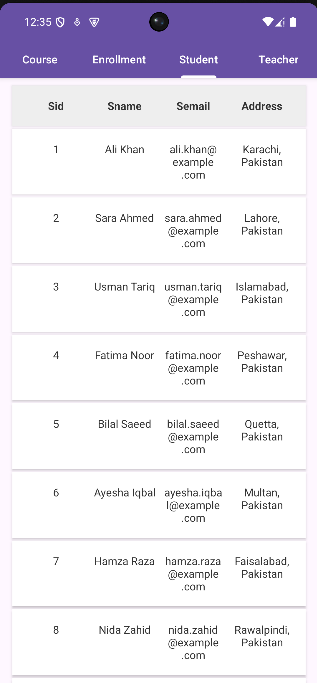
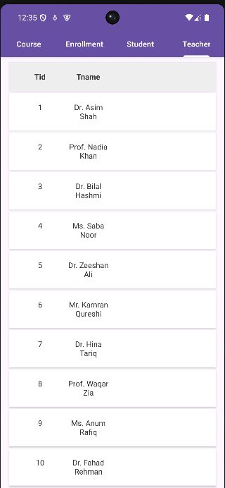
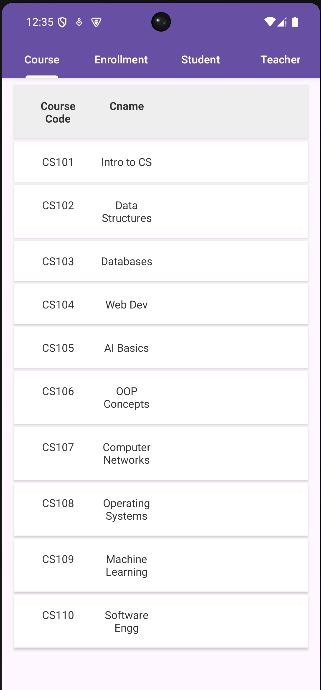
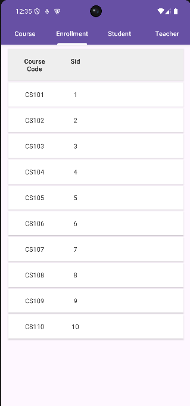

# Mobile Application Development - Assignment 2

## 📱 Android App with Node.js Backend

This repository contains the source code for an Android application developed as part of the Mobile Application Development course assignment. The project demonstrates a full-stack mobile application with a Node.js/Express.js backend hosted on GitHub Codespaces and using Neon PostgreSQL for database management.

## 🚀 Project Structure

The project is divided into two main components:

1. **Android App (Frontend)**
   - Native Android application written in Java
   - Modern Material Design UI components
   - RESTful API integration with backend
   - Local data persistence

2. **Node.js Backend (smiuapi)**
   - Built with Express.js framework
   - RESTful API endpoints
   - Connected to Neon PostgreSQL database
   - Middleware integration (CORS, Pool, Dotenv)
   - Hosted on GitHub Codespaces

## 📸 App Screenshots

<div align="center">
  <table>
    <tr>
      <td align="center"><strong>Splash Screen</strong></td>
      <td align="center"><strong>Student Management</strong></td>
      <td align="center"><strong>Teacher Management</strong></td>
    </tr>
    <tr>
      <td></td>
      <td></td>
      <td></td>
    </tr>
    <tr>
      <td align="center"><strong>Course Management</strong></td>
      <td align="center"><strong>Enrollment Management</strong></td>
    </tr>
    <tr>
      <td></td>
      <td></td>
    </tr>
  </table>
</div>

### 📱 App Features Shown in Screenshots:

1. **Splash Screen**: Initial loading screen with app branding
2. **Student Management**: Interface for managing student records and information
3. **Teacher Management**: Dashboard for handling teacher profiles and assignments
4. **Course Management**: System for managing course details and schedules
5. **Enrollment Management**: Interface for handling student course enrollments

## 🛠️ Technologies Used

### Frontend (Android)
- Java
- Android SDK
- Retrofit for API calls
- Material Design components
- RecyclerView for list displays
- SharedPreferences for local storage

### Backend (Node.js)
- Node.js runtime environment
- Express.js framework
- PostgreSQL (Neon)
- Middleware:
  - cors (Cross-Origin Resource Sharing)
  - pg-pool (PostgreSQL connection pooling)
  - dotenv (Environment variables management)
- GitHub Codespaces for hosting

## 🔧 Setup Instructions

### Prerequisites
- Android Studio
- Node.js (v14 or higher)
- Git
- PostgreSQL

### Running the Android App
1. Clone the repository:
   ```bash
   git clone https://github.com/itxsamad1/MAD-Assignment2-App-Java.git
   ```
2. Open the project in Android Studio
3. Sync Gradle files
4. Run the app on an emulator or physical device

### Backend Setup
1. Navigate to the backend directory:
   ```bash
   cd smiuapi
   ```
2. Install dependencies:
   ```bash
   npm install
   ```
3. Create a `.env` file with your configuration:
   ```env
   PORT=3000
   DATABASE_URL=your_neon_postgresql_url
   ```
4. Start the server:
   ```bash
   npm start
   ```

## 📝 API Documentation

The backend provides the following endpoints:
- `GET /api/students` - Get all students
- `GET /api/teachers` - Get all teachers
- `GET /api/courses` - Get all courses
- `GET /api/enrollments` - Get all enrollments

## 👥 Contributors
- [@itxsamad1](https://github.com/itxsamad1)

## 🤝 Acknowledgments
- Thanks to the course instructors and teaching assistants
- Special thanks to GitHub Codespaces for hosting services
- Neon PostgreSQL for database services 